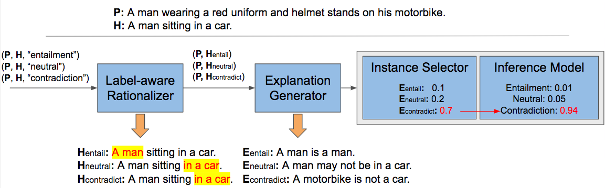
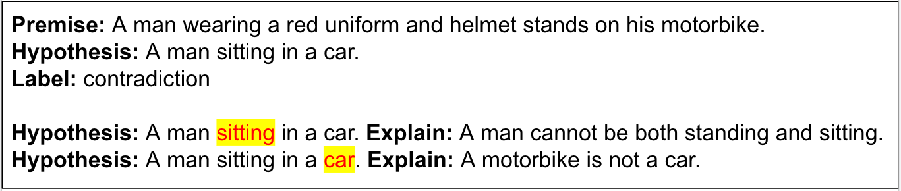

# LIREx: Augmenting Language Inference with Relevant Explanations
This repo is the code release of the paper [LIREx: Augmenting Language Inference with Relevant Explanations](https://sites.google.com/umich.edu/xinyanzhao/home), which is accepted at AAAI-2021.

This work aims at improving language inference tasks by incorporating language explanations, illustrated as following:



A rationalizer generates rationales and then an explanation generator produces natural language explanations (NLEs) based on the rationales so that the NLEs are highly relevant to human rationales. Finally, the instance selector selects the most plausible explanation and couples it with the original premise-hypothesis pair to make predictions.

For the following example, different rationales would induce different explanations:




## Installation

1. Download datasets: the work includes two widely used datasets, namely, e-SNLI that is extended from the Stanfard Natural Language Inference corpus (SNLI) and the Multi-genre Natural Language Inference corpus (MultiNLI).
   - (for SNLI experiments) Please download e-SNLI data (SNLI with explanations) from https://github.com/OanaMariaCamburu/e-SNLI
   - (for MultiNLI experiments) Please doanload MultiNLI data from https://cims.nyu.edu/~sbowman/multinli/

2. Install required dependencies.
```
pip install conda install pytorch torchvision cudatoolkit=10.1 -c pytorch
pip install stanfordnlp
pip install transformers
pip install sklearn
```

## Run SNLI experiments
All commands for SNLI experiments are provided in [experiments_SNLI.sh](./experiments_SNLI.sh) as reference. To reproduce the experiments, please use the following steps:

1. Prepare datasets:
   - Initialize `$esnli_dir` and `$lirex_data_dir`, and then run:
     - `python create_datasets.py --data $esnli_dir/esnli_train_1.csv --output $lirex_data_dir/train_1.json`
     - `python create_datasets.py --data $esnli_dir/esnli_train_2.csv --output $lirex_data_dir/train_2.json`
     - `python create_datasets.py --data $esnli_dir/esnli_dev.csv --output $lirex_data_dir/dev.json`
     - `python create_datasets.py --data $esnli_dir/esnli_test.csv --output $lirex_data_dir/test.json`
   - Then manually merge the two genearted `train_*.json` files.
2. Train rationalizer
   - initialize `$rationalizer_model_name`: use "*bert-base-uncased*" or "*roberta-base*" as encoder
   - initialize `$rationalizer_model_to_save`: model name of the rationalizer
   - run the following command to train the rationalizer and then save it:
     - `python rationalizer/train.py --train_file $lirex_data_dir/train.json --dev_file $lirex_data_dir/dev.json --test_file $lirex_data_dir/test.json --model_name $rationalizer_model_name --model_to_save $rationalizer_model_to_save --lr 1e-5 -batch_size 32 --n_epoch 10`
3. Predict rationalizes and create output files.
   - Initialize `$rationalizer_best_model`: the best rationalizer model name saved.
   - Initialize `$rationalizer_output_dir`: the output directory to store output files ("*-rationale.json")
   - run the following command to apply the trained rationalizer to generate output json files.
     - `python rationalizer/predict.py --train_file $lirex_data_dir/train.json --dev_file $lirex_data_dir/dev.json --test_file $lirex_data_dir/test.json --model_name $rationalizer_model_name --model_to_load $rationalizer_best_model --output_dir $lirex_data_dir`
4. Train explanation generator
   - Prepare data for fine-tuning GPT2. This will generate files for fine-tuning (*-finetune.txt):
     - `python generator/prepare_data_for_finetune.py --data $lirex_data_dir/train.json --output $lirex_data_dir/train-finetune.txt`
     - `python generator/prepare_data_for_finetune.py --data $lirex_data_dir/dev.json --output $lirex_data_dir/dev-finetune.txt`
   - Fine-tune GPT2 model
     - initialize $generator_lm_output_dir: the directory to store trained gpt2 model
     - initialize $generator_generator_gpt_model: the gpt2 architecture used for fine-tune, gpt2-medium or gpt2
     - run  `python generator/GPT2_finetune_lm.py --output_dir $generator_lm_output_dir --model_type gpt2 --model_name_or_path $generator_gpt_model --do_train --train_data_file $lirex_data_dir/train-finetune.txt --do_eval --eval_data_file $lirex_data_dir/dev-finetune.txt --per_device_train_batch_size 1 --gradient_accumulation_steps 4 --save_steps 1000 --save_total_limit 3`    
5. Generate explanations (*-gen.txt)
   - Prepare prompts data for generating explanations. This will generate files for generation (*-prompts.txt)
     - `python generator/prepare_data_for_generation.py --data $lirex_data_dir/train-rationale.json --output $lirex_data_dir/train-prompts.txt`
     - `python generator/prepare_data_for_generation.py --data $lirex_data_dir/dev-rationale.json --output $lirex_data_dir/dev-prompts.txt`
     - `python generator/prepare_data_for_generation.py --data $lirex_data_dir/test-rationale.json --output $lirex_data_dir/test-prompts.txt`
   - Generate explanations. This will run the fine-tuned GPT2 to generate explanation (*-gen.txt)
     - `python generator/GPT2_generate.py --dataset $lirex_data_dir/train-prompts.txt --output $lirex_data_dir/train-gen.txt --model_type gpt2 --model_name_or_path $generator_lm_output_dir --length 30`
     - `python generator/GPT2_generate.py --dataset $lirex_data_dir/dev-prompts.txt --output $lirex_data_dir/dev-gen.txt --model_type gpt2 --model_name_or_path $generator_lm_output_dir --length 30`
     - `python generator/GPT2_generate.py --dataset $lirex_data_dir/test-prompts.txt --output $lirex_data_dir/test-gen.txt --model_type gpt2 --model_name_or_path $generator_lm_output_dir --length 30`
6. Train instance selector and inference model
   - Prepare data. This will generate json files for training (*-expl.json)
     - `python selector_and_inference/prepare_data_with_expl.py --data $lirex_data_dir/train-gen.txt --output $lirex_data_dir/train-expl.json`
     - `python selector_and_inference/prepare_data_with_expl.py --data $lirex_data_dir/dev-gen.txt --output $lirex_data_dir/dev-expl.json`
     - `python selector_and_inference/prepare_data_with_expl.py --data $lirex_data_dir/test-gen.txt --output $lirex_data_dir/test-expl.json`
   - Train instance selector. 
     - Initialize `$selector_model_to_save`: selector model name to save
     - `python selector_and_inference/train_selector.py --train_data $lirex_data_dir/train-expl.json --dev_data $lirex_data_dir/dev-expl.json --test_data $lirex_data_dir/test-expl.json --model_to_save $selector_model_to_save --lr 2e-5 --batch_size 64 --n_epoch 3`
   - Train inference model
     - Initialize `$best_selector_model`: the best selector model from previous step.
     - Initialize `$inference_model_to_save`
     - run `python selector_and_inference/train_inference.py --train_data $lirex_data_dir/train-expl.json --dev_data $lirex_data_dir/dev-expl.json --test_data $lirex_data_dir/test-expl.json --selector_model $best_selector_model --model_to_save $inference_model_to_save --lr 2e-5 --batch_size 64 --n_epoch 3`
     
## Run MultiNLI experiments
1. Initilize all the environment variables in [experiments_MNLI.sh](./experiments_MNLI.sh) similarly as above.
2. Run the following commands one by one (for the description of each command, please refer to the SNLI experiments above).
   - Rationalizer
     - `python rationalizer/predict_mnli.py --dev_matched $lirex_data_dir/multinli_dev_matched.jsonl --dev_mismatched $lirex_data_dir/multinli_dev_mismatched.jsonl --model_name $rationalizer_model_name --model_to_load $rationalizer_best_model --output_dir $lirex_data_dir`
   - Generator
     - `python generator/prepare_data_for_generation_mnli.py --data $lirex_data_dir/multinli-dev-matched-rationale.json --output $lirex_data_dir/multinli-dev-matched-prompts.txt`
     - `python generator/prepare_data_for_generation_mnli.py --data $lirex_data_dir/multinli-dev-mismatched-rationale.json --output $lirex_data_dir/multinli-dev-mismatched-prompts.txt`
     - `python generator/GPT2_generate.py --dataset $lirex_data_dir/multinli-dev-matched-prompts.txt --output $lirex_data_dir/multinli-dev-matched-gen.txt --model_type gpt2 --model_name_or_path $generator_lm_output_dir --length 30`
     - `python generator/GPT2_generate.py --dataset $lirex_data_dir/multinli-dev-mismatched-prompts.txt --output $lirex_data_dir/multinli-dev-mismatched-gen.txt --model_type gpt2 --model_name_or_path $generator_lm_output_dir --length 30`
   - Instance Selector and Inference 
     - `python selector_and_inference/prepare_data_with_expl.py --data $lirex_data_dir/multinli-dev-matched-gen.txt --output $lirex_data_dir/multinli-dev-matched-expl.json`
     - `python selector_and_inference/prepare_data_with_expl.py --data $lirex_data_dir/multinli-dev-mismatched-gen.txt --output $lirex_data_dir/multinli-dev-mismatched-expl.json`
     - `python selector_and_inference/predict.py --data $lirex_data_dir/multinli-dev-matched-expl.json --selector_model $best_selector_model --inference_model $best_inference_model --batch_size 64`
     - `python selector_and_inference/predict.py --data $lirex_data_dir/multinli-dev-mismatched-expl.json --selector_model $best_selector_model --inference_model $best_inference_model --batch_size 64`
